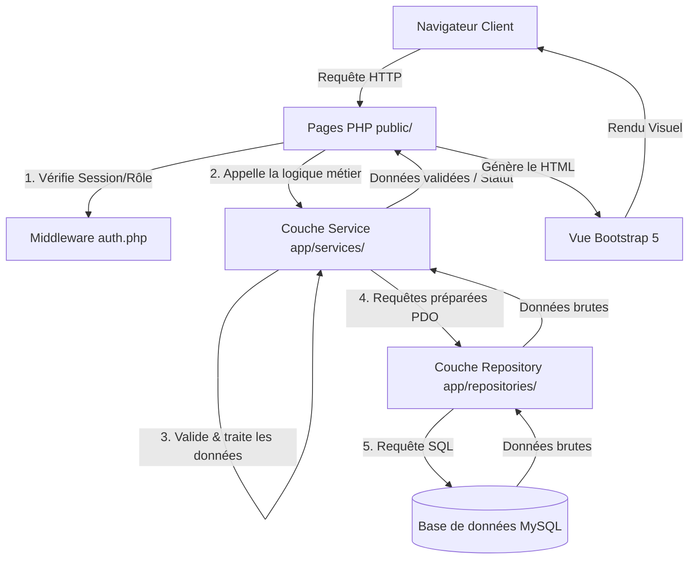

# 🏫 Campus HelpDesk

[](https://www.php.net/)
[](https://www.mysql.com/)
[](https://getbootstrap.com/)
[](#sécurité-et-bonnes-pratiques)

Une solution web moderne, robuste et performante de **gestion de tickets d'assistance (HelpDesk)** conçue spécifiquement pour les établissements scolaires et les campus. Elle fluidifie et sécurise la communication entre les étudiants confrontés à des incidents techniques et l'équipe de support informatique.

---

## 🚀 Fonctionnalités Principales

L'application est structurée autour de **trois portails utilisateurs étanches**, chacun offrant des fonctionnalités adaptées à ses besoins :

### 👨‍🎓 1. Espace Étudiant
* **Création simplifiée de tickets** : Déclaration d'incidents par titre, description, niveau d'urgence (Basse, Moyenne, Haute) et catégorie (Réseau, Matériel, Logiciel...).
* **Création dynamique de catégorie** : Possibilité de spécifier une nouvelle catégorie via l'option "Autre" (qui s'ajoute automatiquement en base de données après validation).
* **Suivi en temps réel** : Tableau de bord listant les tickets créés et leur état d'avancement (`Ouvert`, `En cours`, `Résolu`).
* **Messagerie intégrée** : Espace de discussion sécurisé avec le technicien assigné au ticket.

### 🛠️ 2. Espace Technicien
* **File d'attente intelligente** : Vue globale des tickets du campus, triés par priorité et urgence.
* **Filtres dynamiques** : Filtrage instantané par statut et par niveau de priorité.
* **Auto-assignation** : Possibilité de s'attribuer un ticket en un clic, le faisant passer automatiquement au statut `En cours`.
* **Résolution d'incidents** : Outils pour modifier le statut du ticket et interagir par messages avec l'étudiant concerné.

### 👑 3. Espace Administrateur
* **Tableau de bord de supervision** : Indicateurs clés (KPIs) et raccourcis d'administration.
* **CRUD Utilisateurs complet** : Création, modification et activation/désactivation de comptes avec gestion des rôles (`ETUDIANT`, `TECH`, `ADMIN`).
* **Gestion des Catégories** : Ajout, renommage interactif en ligne et suppression sécurisée des catégories de tickets.
* **Module de Statistiques avancées** : Visualisation analytique des données à l'aide de graphiques interactifs générés avec **Chart.js** (répartition par statut, priorité et volume par catégorie).

---

## 🛠️ Stack Technique

* **Serveur / Logique** : PHP 8.1+ (Natif, typage strict activé `declare(strict_types=1)`)
* **Base de données** : MySQL 8.0+ via la couche d'accès sécurisée **PDO**
* **Interface (Front-end)** : HTML5, Bootstrap 5.3 (Responsive Design) et Vanilla JavaScript
* **Visualisation de données** : Chart.js (Intégration de graphiques dynamiques)
* **Serveur local conseillé** : XAMPP, WampServer ou Laragon (Apache + MySQL)

---

## 📐 Architecture Logicielle

Le projet est conçu selon une architecture modulaire en **3 couches indépendantes (Clean Architecture / N-Tier)**. Cela garantit une séparation stricte des préoccupations (*Separation of Concerns*), facilitant la maintenance et l'évolutivité sans la lourdeur d'un framework externe :



* **1. Couche Repositories (`app/repositories/`)** : Responsable uniquement des opérations de lecture/écriture en base de données. Elle n'embarque aucun contrôle logique ou métier.
* **2. Couche Services (`app/services/`)** : Le cœur fonctionnel. Elle valide les données reçues, applique les règles métier, gère les interactions complexes entre modèles et applique les politiques de sécurité (contrôle d'accès).
* **3. Couche Contrôleur/Vue (`public/`)** : Les scripts publics agissent comme contrôleurs frontaux. Ils vérifient l'authentification via le middleware, interrogent la couche Service, puis injectent les résultats dans des vues HTML épurées avec Bootstrap.

---

## 🛡️ Sécurité et Bonnes Pratiques

Le code a été développé avec une attention rigoureuse portée à la sécurité afin de contrer les failles courantes de l'OWASP :

* **Injections SQL** : Utilisation systématique de requêtes préparées PDO avec paramètres nommés (aucun assemblage de chaînes SQL en dur).
* **Failles XSS** : Échappement systématique de toutes les variables affichées à l'écran via la fonction `htmlspecialchars()`.
* **Session Fixation** : Régénération forcée de l'ID de session (`session_regenerate_id(true)`) à chaque connexion réussie.
* **Cloisonnement horizontal (IDOR)** : Contrôle d'accès strict côté serveur. Même si un étudiant modifie l'identifiant dans l'URL (`?id=99`), la couche service bloque la requête et retourne `null` si le ticket ne lui appartient pas.
* **Hashage des mots de passe** : Chiffrement à sens unique via l'algorithme fort `bcrypt` (`password_hash` et `password_verify`).
* **Typage strict** : Utilisation de `declare(strict_types=1)` en tête de chaque fichier PHP pour prévenir les erreurs de conversion de type implicite.

---

## 💾 Installation et Lancement

Suivez ces étapes pour déployer et tester l'application localement sur votre machine :

### 📋 Prérequis
* Un environnement PHP (8.1 ou supérieur) et MySQL (8.0 ou supérieur).
* L'outil **XAMPP** (recommandé sous Windows) ou équivalent.

### 🔧 Étapes d'installation

1. **Cloner ou copier le projet** dans le dossier de publication de votre serveur web local :
   * Pour XAMPP : `C:\xampp\htdocs\campus_helpdesk`

2. **Démarrer les services** **Apache** et **MySQL** depuis le panneau de contrôle de votre serveur local (ex: XAMPP Control Panel).

3. **Créer et importer la base de données** :
   * Ouvrez votre outil de gestion de base de données (ex: *phpMyAdmin* à l'adresse `http://localhost/phpmyadmin`).
   * Créez une base de données nommée `campus_helpdesk` (ou laissez le script s'en charger).
   * Importez d'abord le fichier SQL du schéma : [`db/schema.sql`](file:///c:/xampp/htdocs/SLAM/campus_helpdesk/db/schema.sql)
   * Importez ensuite le fichier SQL de données de test : [`db/seed.sql`](file:///c:/xampp/htdocs/SLAM/campus_helpdesk/db/seed.sql)

   *Alternative en ligne de commande (CLI) :*
   ```bash
   mysql -u root -p -e "CREATE DATABASE campus_helpdesk CHARACTER SET utf8mb4 COLLATE utf8mb4_unicode_ci;"
   mysql -u root -p campus_helpdesk < db/schema.sql
   mysql -u root -p campus_helpdesk < db/seed.sql
   ```

4. **Configurer la connexion à la base de données** :
   * Ouvrez le fichier de configuration [`app/config/db.php`](file:///c:/xampp/htdocs/SLAM/campus_helpdesk/app/config/db.php).
   * Par défaut, il est configuré pour une installation standard **XAMPP** (hôte `localhost`, utilisateur `root`, sans mot de passe). Modifiez ces paramètres si vos accès MySQL diffèrent.

5. **Accéder à l'application** :
   * Ouvrez votre navigateur et accédez à la page de présentation : `http://localhost/campus_helpdesk/presentation.html`
   * Ou accédez directement à la mire de connexion : `http://localhost/campus_helpdesk/public/auth/login.php`

---

## 🔑 Comptes de Test (Démo)

Pour tester rapidement les différents espaces de l'application, les comptes suivants sont pré-configurés dans le jeu d'essai SQL :

| Rôle | Adresse Email | Mot de passe | Description de l'espace |
| :--- | :--- | :--- | :--- |
| **🎓 Étudiant** | `student@campus.local` | `student` | Création de ticket, suivi de son tableau de bord et messagerie. |
| **🛠️ Technicien** | `tech@campus.local` | `tech` | File d'attente globale, assignation, changement de statut et réponses. |
| **👑 Administrateur** | `admin@campus.local` | `admin` | CRUD utilisateurs, gestion des catégories de tickets et graphiques analytiques (Chart.js). |

---

## 🧠 Ce que j'ai appris

Ce projet a été une formidable opportunité de mettre en pratique des concepts d'architecture logicielle et de sécurité web avancés en PHP natif :

### 🎯 Le Défi Technique : Le Contrôle d'Accès côté Serveur & l'étanchéité des Rôles
Lors de la conception d'une application multi-portails (Étudiant, Technicien, Administrateur), un piège classique consiste à masquer des boutons ou des formulaires dans le HTML en fonction du rôle de l'utilisateur (sécurité par l'obscurité). Cependant, un utilisateur malveillant ou curieux peut facilement intercepter les requêtes HTTP ou modifier l'identifiant d'un ticket dans la barre d'adresse (`ticket_detail.php?id=12`) pour accéder aux données d'un autre étudiant (faille de type **IDOR** - *Insecure Direct Object Reference*).

### 💡 La Résolution : Centralisation de la politique de sécurité dans la couche Service
Pour résoudre ce problème de manière infaillible, j'ai implémenté un **double niveau de sécurité** :

1. **Au niveau de l'accès aux pages (Middleware)** : 
   Grâce aux fonctions utilitaires `requireLogin()` et `requireRole()` dans [`app/middleware/auth.php`](file:///c:/xampp/htdocs/SLAM/campus_helpdesk/app/middleware/auth.php), l'accès aux répertoires `public/tech/` et `public/admin/` est bloqué dès le chargement de la page si la session de l'utilisateur ne possède pas le rôle requis.

2. **Au niveau de la donnée (Couche Service)** :
   Dans [`app/services/TicketService.php`](file:///c:/xampp/htdocs/SLAM/campus_helpdesk/app/services/TicketService.php), la méthode `getTicketDetails()` intègre le cloisonnement d'accès aux données :
   ```php
   public function getTicketDetails(int $ticketId, int $userId, string $userRole): ?array {
       $ticket = $this->ticketRepo->getTicketById($ticketId);
       
       if (!$ticket) {
           return null;
       }

       // Contrôle d'accès strict côté serveur
       if ($userRole === 'ETUDIANT' && (int)$ticket['cree_par'] !== $userId) {
           return null; // Bloque l'accès si l'étudiant tente de lire le ticket d'un tiers
       }

       // ... chargement des messages et de l'historique
       return $ticket;
   }
   ```
   Si l'identifiant du ticket ne correspond pas à l'étudiant connecté, la méthode renvoie silencieusement `null`. Le contrôleur frontal affiche alors une erreur propre "Ticket non trouvé" (ou 403), protégeant ainsi l'intégrité de la base de données.

### 📈 Bilan
Cette rigueur architecturale m'a permis de comprendre l'importance d'avoir une couche métier (Service) étanche et découplée de la couche de rendu (HTML/CSS). C'est le fondement indispensable pour écrire du code propre, sécurisé et prêt pour de futures évolutions (par exemple, la transition vers une API RESTful où la couche vue serait remplacée par un framework front-end tel que React ou Vue.js).
